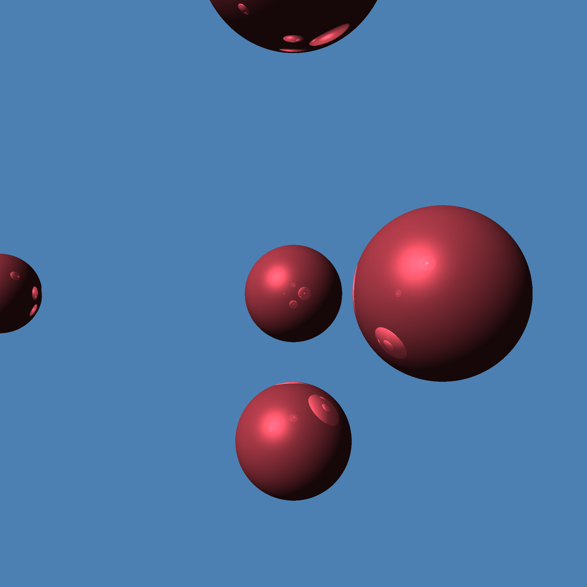

# KTracer
Ray Tracing Engine

1. KT math lib (vec3, vec4, mat4)
2. Perspective projection
3. Surface intersection (sphere)
4. Phong shading

More to come
### Early version of traced image 11/18/2021

